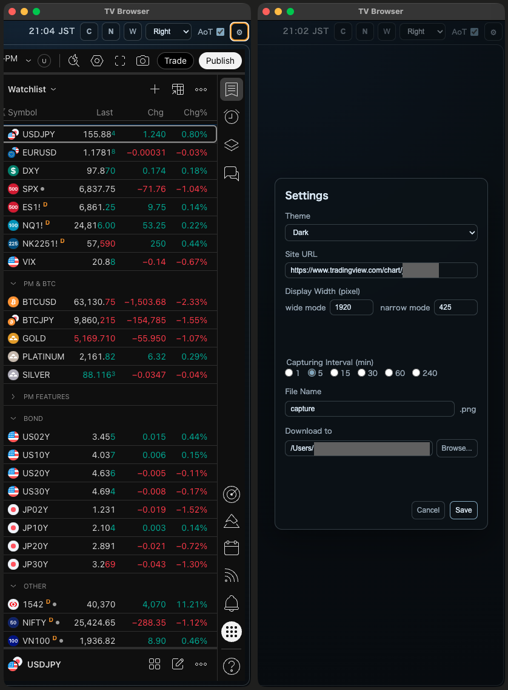
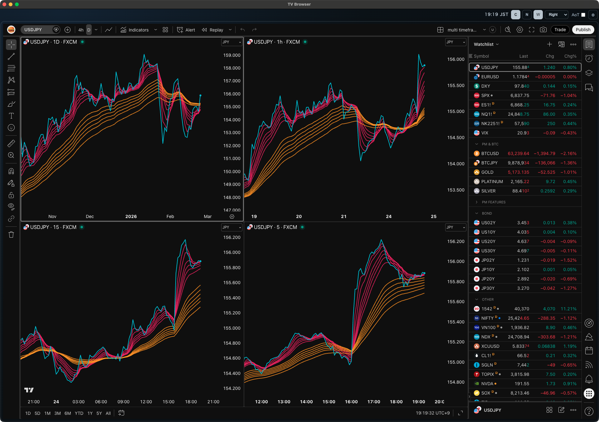
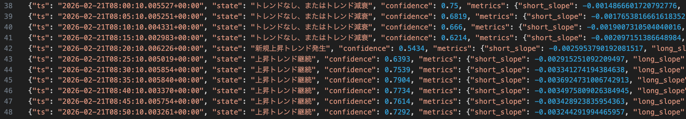

TradingVewを見るためのブラウザアプリです。

* Watchlist部分だけを常に前面に表示させるのがおもな目的です。
* 定期的にチャートのスクリーンショットを(上書き)保存でき、それを画像解析してトレード判断に利用できます。
* 素人がCodexで作成したものなのでソフトウェアとしての品質は知らん。

---

機能概要

* WebContentsViewでカードを作ってTradingViewを表示
* **常に前面に表示** に対応 (AoT: Always on Top ボタン)
* `W`(Width)トグルボタンで横幅を全体表示するか(wide mode)、Watchlistだけを表示するか(narrow mode)を変更可能
* アプリをディスプレイの右端に配置して `W` ボタンで左にウィンドウを広げたい場合は `Left` モードを選択
* アプリをディスプレイの左端に配置して `W` ボタンで右にウィンドウを広げたい場合は `Right` モードを選択
* `N` (New Window) ボタンで新規ウィンドウを開く (ショートカットキー "Cmd+N" を割り当て)
* `C` (Periodic Screen Capture) ボタンでWebContentsView部分の画像を指定ディレクトリに定期的に保存
  * 注: WebContentsViewが一部でもディスプレイに表示されていないとElectron(Chromium)がコンテンツ更新を止めてしまうので AoT有効またはWebContentsView部分の一部だけでもディスプレイに表示させ、ウィンドウの最小化または完全オクルージョンは避ける必要があります。

細かな実装は [./doc/implementation.md](./doc/implementation.md) を参照

---

Watchlistだけを表示した状態 (`W` ボタンで narrow mode)

---

全体を表示した状態 (`W` トグルボタン(白バック)で wide mode) \
(`C` ボタンをクリックし、ボタンが白バックになっている間は指定した分数で定期的にスクリーンショットを上書き保存)

この画像の場合、日足〜5分足のローソクチャートに GMMA (Guppy Multi Moving Average) を表示しており、短期EMAグループと長期EMAグループの傾きと拡散・縮小を評価してトレンド判断する、といったことが考えられます。([visual-trading-gmma](https://github.com/hirotgr/visual-trading-gmma)として作成中)

