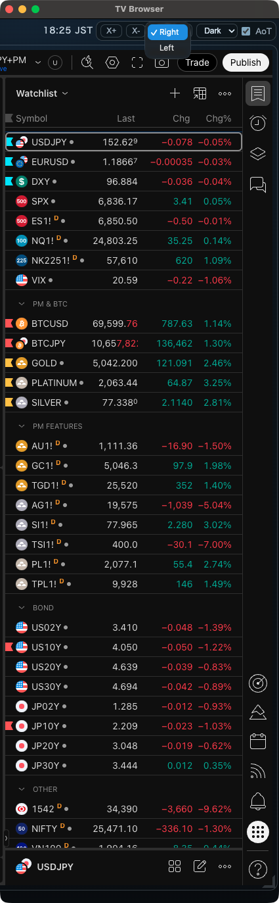
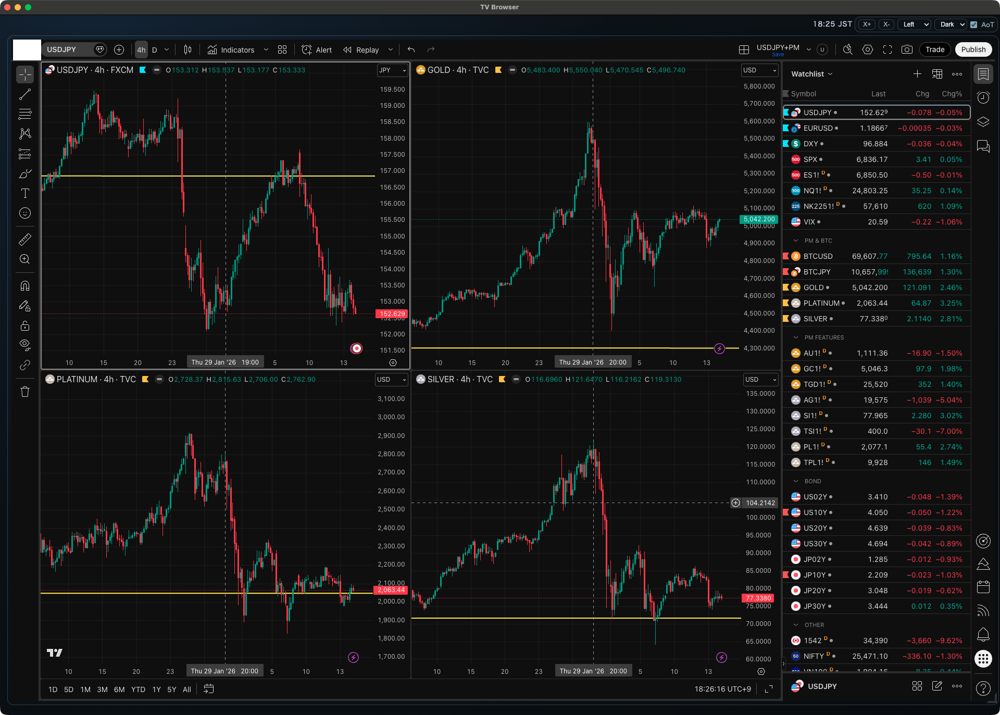

TradingVewを見るためのブラウザアプリです。

* WebContentsViewでカードを作ってTradingViewを表示 (カードはリサイズ可能)
* **常に前面に表示** に対応 (AoT: Always on Top)
* **X-** ボタンで Watchlist だけを表示できる程度に横幅を変更
* **X+** ボタンで全体を表示できる程度に横幅を変更
* アプリをディスプレイの右端に配置して **X+** ボタンで左にウィンドウを広げたい場合は **Left** モードを選択
* アプリをディスプレイの左端に配置して **X+** ボタンで右にウィンドウを広げたい場合は **Right** モードを選択

---

Watchlistだけを表示した状態 (**X-** ボタン)

---

全体をを表示した状態 (**X+** ボタン)

